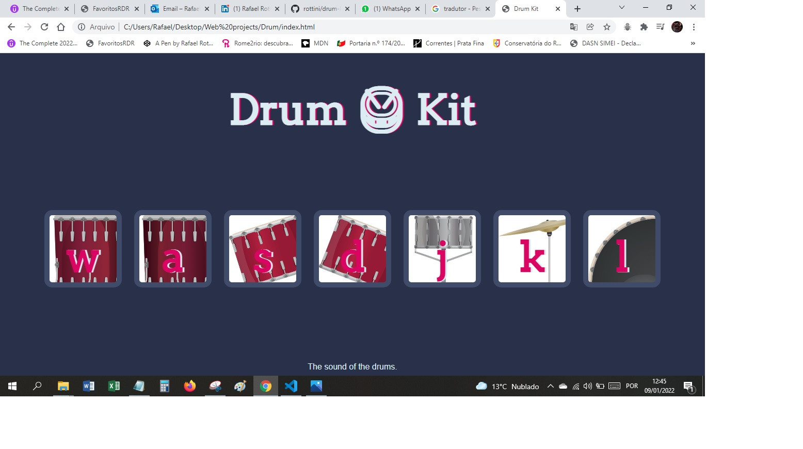

JavaScript Exercise linking mouse and keyboard clicks to drums/imagens and playing their respective sounds.

## Overview

### Screenshot

### Links

- Live Site URL: [github-pages](https://rottini.github.io/drum-kit/)

## My process

### Built with

- Semantic HTML5 markup
- CSS custom properties
- JavasScript - eventListener function

## Author

- Website - [Rafael](https://github.com/rottini)
- Udemy-Web Development Bootcamp - [rottini](https://github.com/rottini/drum-kit)
